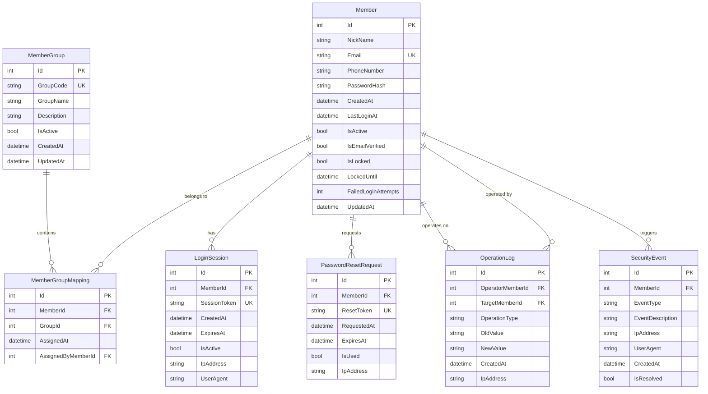

# Data Model: 會員管理系統

**Feature**: 會員管理系統 | **Phase**: 1 - Design | **Date**: 2024年10月25日

## Entity Relationship Diagram



## Entity Specifications

### Member (會員實體)

**Purpose**: 代表系統中的會員使用者，包含身份資訊、認證資料和狀態管理。

```csharp
public class Member
{
    public int Id { get; set; }                    // 主鍵
    public string NickName { get; set; }           // 暱稱 (最大50字元)
    public string Email { get; set; }              // 電子郵件 (唯一,最大100字元)
    public string? PhoneNumber { get; set; }       // 電話號碼 (可選,最大20字元)
    public string PasswordHash { get; set; }       // 密碼雜湊值
    public DateTime CreatedAt { get; set; }        // 建立時間
    public DateTime? LastLoginAt { get; set; }     // 最後登入時間
    public bool IsActive { get; set; }             // 是否啟用
    public bool IsEmailVerified { get; set; }      // 電子郵件是否驗證
    public bool IsLocked { get; set; }             // 是否鎖定
    public DateTime? LockedUntil { get; set; }     // 鎖定至何時
    public int FailedLoginAttempts { get; set; }   // 失敗登入次數
    public DateTime UpdatedAt { get; set; }        // 更新時間
}
```

**Constraints**:
- Email 必須唯一
- NickName 不可為空，最大長度 50
- PasswordHash 使用 ASP.NET Core Identity 標準雜湊
- FailedLoginAttempts >= 5 時 IsLocked = true

### MemberGroup (會員群組實體)

**Purpose**: 定義會員群組，用於權限管理和會員分類。

```csharp
public class MemberGroup  
{
    public int Id { get; set; }                    // 主鍵
    public string GroupCode { get; set; }          // 群組代碼 (唯一,最大20字元)
    public string GroupName { get; set; }          // 群組名稱 (最大50字元)
    public string? Description { get; set; }       // 群組描述 (最大200字元)
    public bool IsActive { get; set; }             // 是否啟用
    public DateTime CreatedAt { get; set; }        // 建立時間
    public DateTime UpdatedAt { get; set; }        // 更新時間
}
```

**Default Groups**:
```sql
INSERT INTO MemberGroup (GroupCode, GroupName, Description, IsActive, CreatedAt, UpdatedAt) VALUES
('ADMIN', '管理者', '系統管理員，具有完整管理權限', 1, NOW(), NOW()),
('MEMBER', '一般會員', '基本會員權限', 1, NOW(), NOW()),
('PREMIUM', '付費會員', '付費會員，具有進階功能權限', 1, NOW(), NOW());
```

### MemberGroupMapping (會員群組對應實體)

**Purpose**: 管理會員與群組的多對多關係。

```csharp
public class MemberGroupMapping
{
    public int Id { get; set; }                    // 主鍵
    public int MemberId { get; set; }              // 會員ID (外鍵)
    public int GroupId { get; set; }               // 群組ID (外鍵)
    public DateTime AssignedAt { get; set; }       // 分配時間
    public int AssignedByMemberId { get; set; }    // 分配者ID (外鍵)
    
    // Navigation Properties
    public Member Member { get; set; }
    public MemberGroup Group { get; set; }
    public Member AssignedBy { get; set; }
}
```

**Constraints**:
- (MemberId, GroupId) 組合唯一
- AssignedByMemberId 必須是 ADMIN 群組成員

### LoginSession (登入會議實體)

**Purpose**: 管理會員登入會議，支援多設備登入追蹤。

```csharp
public class LoginSession
{
    public int Id { get; set; }                    // 主鍵
    public int MemberId { get; set; }              // 會員ID (外鍵)
    public string SessionToken { get; set; }       // 會議令牌 (唯一,UUID)
    public DateTime CreatedAt { get; set; }        // 建立時間
    public DateTime ExpiresAt { get; set; }        // 過期時間 (預設24小時)
    public bool IsActive { get; set; }             // 是否有效
    public string? IpAddress { get; set; }         // IP位址
    public string? UserAgent { get; set; }         // 瀏覽器資訊
    
    // Navigation Properties
    public Member Member { get; set; }
}
```

**Session Management**:
- 每次登入建立新 session
- 過期會議自動失效
- 支援主動登出 (設定 IsActive = false)

### PasswordResetRequest (密碼重設請求實體)

**Purpose**: 管理密碼重設請求和令牌。

```csharp
public class PasswordResetRequest
{
    public int Id { get; set; }                    // 主鍵
    public int MemberId { get; set; }              // 會員ID (外鍵)
    public string ResetToken { get; set; }         // 重設令牌 (唯一,UUID)
    public DateTime RequestedAt { get; set; }      // 請求時間
    public DateTime ExpiresAt { get; set; }        // 過期時間 (5分鐘後)
    public bool IsUsed { get; set; }               // 是否已使用
    public string? IpAddress { get; set; }         // 請求IP位址
    
    // Navigation Properties
    public Member Member { get; set; }
}
```

**Security Rules**:
- 令牌 5 分鐘後自動過期
- 使用後立即標記為已使用
- 每個會員同時只能有一個有效重設請求

### OperationLog (操作記錄實體)

**Purpose**: 記錄所有會員資料異動，提供審核追蹤。

```csharp
public class OperationLog
{
    public int Id { get; set; }                    // 主鍵
    public int OperatorMemberId { get; set; }      // 操作者ID (外鍵)
    public int? TargetMemberId { get; set; }       // 目標會員ID (外鍵)
    public string OperationType { get; set; }      // 操作類型 (CREATE,UPDATE,DELETE,LOGIN等)
    public string? OldValue { get; set; }          // 舊值 (JSON格式)
    public string? NewValue { get; set; }          // 新值 (JSON格式)
    public DateTime CreatedAt { get; set; }        // 操作時間
    public string? IpAddress { get; set; }         // 操作IP位址
    
    // Navigation Properties
    public Member Operator { get; set; }
    public Member? TargetMember { get; set; }
}
```

**Operation Types**:
- `MEMBER_CREATE`: 建立會員
- `MEMBER_UPDATE`: 更新會員資料
- `MEMBER_DELETE`: 刪除會員
- `MEMBER_LOGIN`: 會員登入
- `MEMBER_LOGOUT`: 會員登出
- `PASSWORD_RESET`: 密碼重設
- `GROUP_ASSIGN`: 群組分配
- `ACCOUNT_LOCK`: 帳號鎖定
- `ACCOUNT_UNLOCK`: 帳號解鎖

### SecurityEvent (安全事件實體)

**Purpose**: 記錄安全相關事件，用於監控和預警。

```csharp
public class SecurityEvent
{
    public int Id { get; set; }                    // 主鍵
    public int? MemberId { get; set; }             // 會員ID (外鍵,可為null)
    public string EventType { get; set; }          // 事件類型
    public string EventDescription { get; set; }   // 事件描述
    public string? IpAddress { get; set; }         // IP位址
    public string? UserAgent { get; set; }         // 瀏覽器資訊
    public DateTime CreatedAt { get; set; }        // 事件時間
    public bool IsResolved { get; set; }           // 是否已處理
    
    // Navigation Properties
    public Member? Member { get; set; }
}
```

**Event Types**:
- `LOGIN_FAILED`: 登入失敗
- `ACCOUNT_LOCKED`: 帳號鎖定
- `PASSWORD_RESET_REQUEST`: 密碼重設請求
- `SUSPICIOUS_LOGIN`: 可疑登入
- `MULTIPLE_LOGIN_ATTEMPTS`: 多次登入嘗試
- `SESSION_EXPIRED`: 會議過期

## Database Schema

### Table Creation Scripts

```sql
-- 會員資料表
CREATE TABLE Member (
    Id INT AUTO_INCREMENT PRIMARY KEY,
    NickName VARCHAR(50) NOT NULL,
    Email VARCHAR(100) NOT NULL UNIQUE,
    PhoneNumber VARCHAR(20),
    PasswordHash VARCHAR(255) NOT NULL,
    CreatedAt DATETIME NOT NULL DEFAULT CURRENT_TIMESTAMP,
    LastLoginAt DATETIME,
    IsActive BOOLEAN NOT NULL DEFAULT TRUE,
    IsEmailVerified BOOLEAN NOT NULL DEFAULT FALSE,
    IsLocked BOOLEAN NOT NULL DEFAULT FALSE,
    LockedUntil DATETIME,
    FailedLoginAttempts INT NOT NULL DEFAULT 0,
    UpdatedAt DATETIME NOT NULL DEFAULT CURRENT_TIMESTAMP ON UPDATE CURRENT_TIMESTAMP,
    
    INDEX idx_email (Email),
    INDEX idx_nickname (NickName),
    INDEX idx_active (IsActive),
    INDEX idx_created (CreatedAt)
);

-- 會員群組資料表
CREATE TABLE MemberGroup (
    Id INT AUTO_INCREMENT PRIMARY KEY,
    GroupCode VARCHAR(20) NOT NULL UNIQUE,
    GroupName VARCHAR(50) NOT NULL,
    Description VARCHAR(200),
    IsActive BOOLEAN NOT NULL DEFAULT TRUE,
    CreatedAt DATETIME NOT NULL DEFAULT CURRENT_TIMESTAMP,
    UpdatedAt DATETIME NOT NULL DEFAULT CURRENT_TIMESTAMP ON UPDATE CURRENT_TIMESTAMP,
    
    INDEX idx_group_code (GroupCode),
    INDEX idx_active (IsActive)
);

-- 會員群組對應資料表
CREATE TABLE MemberGroupMapping (
    Id INT AUTO_INCREMENT PRIMARY KEY,
    MemberId INT NOT NULL,
    GroupId INT NOT NULL,
    AssignedAt DATETIME NOT NULL DEFAULT CURRENT_TIMESTAMP,
    AssignedByMemberId INT NOT NULL,
    
    FOREIGN KEY (MemberId) REFERENCES Member(Id) ON DELETE CASCADE,
    FOREIGN KEY (GroupId) REFERENCES MemberGroup(Id) ON DELETE CASCADE,
    FOREIGN KEY (AssignedByMemberId) REFERENCES Member(Id),
    
    UNIQUE KEY uk_member_group (MemberId, GroupId),
    INDEX idx_member (MemberId),
    INDEX idx_group (GroupId)
);

-- 登入會議資料表
CREATE TABLE LoginSession (
    Id INT AUTO_INCREMENT PRIMARY KEY,
    MemberId INT NOT NULL,
    SessionToken VARCHAR(255) NOT NULL UNIQUE,
    CreatedAt DATETIME NOT NULL DEFAULT CURRENT_TIMESTAMP,
    ExpiresAt DATETIME NOT NULL,
    IsActive BOOLEAN NOT NULL DEFAULT TRUE,
    IpAddress VARCHAR(45),
    UserAgent TEXT,
    
    FOREIGN KEY (MemberId) REFERENCES Member(Id) ON DELETE CASCADE,
    
    INDEX idx_member (MemberId),
    INDEX idx_token (SessionToken),
    INDEX idx_expires (ExpiresAt),
    INDEX idx_active (IsActive)
);

-- 密碼重設請求資料表
CREATE TABLE PasswordResetRequest (
    Id INT AUTO_INCREMENT PRIMARY KEY,
    MemberId INT NOT NULL,
    ResetToken VARCHAR(255) NOT NULL UNIQUE,
    RequestedAt DATETIME NOT NULL DEFAULT CURRENT_TIMESTAMP,
    ExpiresAt DATETIME NOT NULL,
    IsUsed BOOLEAN NOT NULL DEFAULT FALSE,
    IpAddress VARCHAR(45),
    
    FOREIGN KEY (MemberId) REFERENCES Member(Id) ON DELETE CASCADE,
    
    INDEX idx_member (MemberId),
    INDEX idx_token (ResetToken),
    INDEX idx_expires (ExpiresAt)
);

-- 操作記錄資料表
CREATE TABLE OperationLog (
    Id INT AUTO_INCREMENT PRIMARY KEY,
    OperatorMemberId INT NOT NULL,
    TargetMemberId INT,
    OperationType VARCHAR(50) NOT NULL,
    OldValue TEXT,
    NewValue TEXT,
    CreatedAt DATETIME NOT NULL DEFAULT CURRENT_TIMESTAMP,
    IpAddress VARCHAR(45),
    
    FOREIGN KEY (OperatorMemberId) REFERENCES Member(Id),
    FOREIGN KEY (TargetMemberId) REFERENCES Member(Id) ON DELETE SET NULL,
    
    INDEX idx_operator (OperatorMemberId),
    INDEX idx_target (TargetMemberId),
    INDEX idx_operation (OperationType),
    INDEX idx_created (CreatedAt)
);

-- 安全事件資料表
CREATE TABLE SecurityEvent (
    Id INT AUTO_INCREMENT PRIMARY KEY,
    MemberId INT,
    EventType VARCHAR(50) NOT NULL,
    EventDescription TEXT NOT NULL,
    IpAddress VARCHAR(45),
    UserAgent TEXT,
    CreatedAt DATETIME NOT NULL DEFAULT CURRENT_TIMESTAMP,
    IsResolved BOOLEAN NOT NULL DEFAULT FALSE,
    
    FOREIGN KEY (MemberId) REFERENCES Member(Id) ON DELETE SET NULL,
    
    INDEX idx_member (MemberId),
    INDEX idx_event_type (EventType),
    INDEX idx_created (CreatedAt),
    INDEX idx_resolved (IsResolved)
);
```

### Seed Data

```sql
-- 插入預設群組
INSERT INTO MemberGroup (GroupCode, GroupName, Description, IsActive) VALUES
('ADMIN', '管理者', '系統管理員，具有完整管理權限', TRUE),
('MEMBER', '一般會員', '基本會員權限', TRUE),
('PREMIUM', '付費會員', '付費會員，具有進階功能權限', TRUE);

-- 插入預設管理員帳號
INSERT INTO Member (NickName, Email, PasswordHash, IsActive, IsEmailVerified) VALUES
('系統管理員', 'ansonjang@gmail.com', 'hashed-password-here', TRUE, TRUE);

-- 將管理員分配到管理者群組
INSERT INTO MemberGroupMapping (MemberId, GroupId, AssignedByMemberId) VALUES
(1, 1, 1);
```

## Performance Considerations

### Database Indexes
- `Member.Email`: 唯一索引用於登入查詢
- `Member.NickName`: 索引用於搜尋功能
- `Member.IsActive`: 索引用於過濾活躍會員
- `LoginSession.SessionToken`: 唯一索引用於會議驗證
- `PasswordResetRequest.ResetToken`: 唯一索引用於令牌驗證

### Query Optimization
- 使用複合索引優化常見查詢組合
- 定期清理過期的會議和重設請求
- 實作查詢結果快取策略

### Data Archiving
- 操作記錄超過 1 年的資料自動歸檔
- 安全事件已處理且超過 6 個月的資料歸檔
- 過期的登入會議和密碼重設請求定期清理

## Validation Rules

### Business Rules
1. 電子郵件格式驗證和唯一性檢查
2. 密碼複雜度驗證 (至少8字元，包含大小寫字母、數字、特殊字符)
3. 暱稱長度限制 (1-50字元) 且不可包含特殊字符
4. 同一會員不可重複分配到相同群組
5. 只有管理者可以分配會員到群組
6. 會員刪除前必須先移除所有群組關聯

### Data Integrity
1. 外鍵約束確保資料一致性
2. 級聯刪除規則防止孤立資料
3. 觸發器維護 UpdatedAt 時間戳
4. 交易確保複雜操作的原子性

## Migration Strategy

### Development Phase
1. 建立完整的資料庫架構
2. 插入種子資料和測試資料
3. 驗證所有約束和索引

### Production Deployment
1. 備份現有資料庫
2. 執行結構變更腳本
3. 插入預設資料
4. 驗證資料完整性
5. 更新應用程式組態

**下一步**: 建立 API 合約規格 (contracts/) 和快速啟動指南 (quickstart.md)